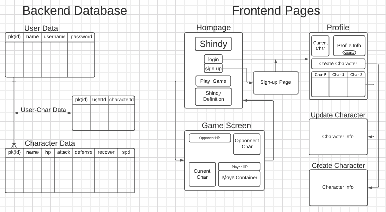

## Initial Purpose
The purpose of this project is to develop a simple and fun turn-based combat game. Users will be able to play the game as a guest when they arrive on the page and if they enjoy it they will be able to create an account. By creating an account they will have access to build their own custom characters as well as play with the pre-loaded character. The players will be able to play games against the computer in the intial stages of the application with hope to broaden the game to allow pvp as well.

## Links
Front-end Repo: https://github.com/zotacy/SEI-project4-shindy-frontend
Front-end Heroku: https://shindyapp.herokuapp.com/shindy
Back-end Repo: https://github.com/zotacy/SEI-project4-shindy-backend
Back-end Heroku: https://shindy-api.herokuapp.com/

## Getting Started
### Wireframe

<!-- WireFrame Link: https://lucid.app/lucidchart/d710dfb3-2dae-41c6-b038-c00fec8383a6/edit?beaconFlowId=CC9809F839227E5B&page=0_0#?folder_id=home&browser=icon -->

|**Set-up**|**Backend**|**Frontend**|
|--------|----------|--------|
|Create/Edit ReadMe|Setup PostGreSQl Database|Created React App|
|Create Repos (backend/frontend)|Setup MVC|Import Data from backend API|
|Create Wireframes|Stored Data: Authentication, User, Character, UserCharacter|Components: Homepage, Profile, Create Character, Update Character, GameScreen|
|...|...|CRUD & Game-Logic|
|...|Consistency/Efficiency|CSS/Styling/Layout|

## Technology Used
* Visual Studio Code
* Node.js/Express, MVC, PostGreSQL
* React Web Framework, DOM-Maniplulation 
* APIs, Axios
* Heroku, GitHub
* Lucid Chart (Wireframe Designs)

## App Components
|**Components**|**Description**|
|--------------|---------------|
|App (Homepage)|Main screen when app is pulled up. Includes: intro to game, method to Login/Signup, method to play game (as guest)|
|Profile|User profile which contains user information as well as the users specific characters and method to play new games. Users are able to update their personal information as well as create/update their specific characters. The preset character(s) cannot be modified|
|CreateCharacter|Method within user profile to create custom characters and modify their stats|
|UpdateCharacter|Method within user profile to update custom characters and modify their stats|
|GameScreen|This is the screen where game play occurs and game-logic is implementd. It is a turn-based game. Inital setup will allow user to play against the computer & utlizes a set of 4 moves.|
|Game Logic|Win/Lose Cases, Determine Turns, Utlizes set fo 4 moves|

## General Requirements/MVP
Requirements for the project are as follows:
1. You must create 2 apps: A Node/Express backend and a React frontend that communicate with each other.
2. Develop a complete product.
3. Implement thoughtful user stories.
4. Be deployed online through Heroku.

## App Features for Next Rendition
1. Improved Character Customization
    - Add stat caps for characters
    - Add character traits (combat oriented)
2. Game Logic
    - Computer automatically executes it's turn with a button click
    - PvP
    - Allow logged in players to use their personal characters for combat.
3. Overall
    - Deployment: Optimized for mobile and web
    - Styling: Improved css/styling

## User Stories
- As a user, I should be able to create an account.
- As a user, I should be able to view my characters.
- As a user, I should be able to access my characters stats.
- As a user, I should be able to create a custom character.
- As a user, I should be able to update my custom characters stats.
- As a user, I should be able to access the home page from my profile (and stay logged in).
- As a user, I should be able to play the game "Shindy" (as a guest or account owner).
- As a user, I should be able to understand how to play the game "Shindy" (Intuitive controls).

## Standout Code Snippets
Utilizing terniaries to display and hide objects. 
Player Profile example: Adding a character Cap
```js
{this.props.user.Characters.length <4 
    ? <button onClick={this.toggleShow} id="toggle">Add Character</button> 
    : <div className="charCap">
        <h2>Reached Character Max of 4</h2><br/>
        <h3>(delete or update current character)</h3>
        </div>
}
<br/>
{this.state.show ? 
    <div className="addCharacter">
    <form onSubmit={this.props.addCharacter} id="addCharForm">
        <input type="text" name="name" placeholder="Character Name/Title"/><br/>
        <input type="text" name="hp" placeholder="Max Hp"/><br/>
        <input type="text" name="attack" placeholder="Atk Stat"/><br/>
        <input type="text" name="defense" placeholder="Defense Stat"/><br/>
        <input type="text" name="recover" placeholder="Recover Stat"/><br/>
        <input type="text" name="spd" placeholder='spd (enter 1)'/><br/>
        <input type="hidden" name="userId" value={playerDetails.id}/>
        <input type="submit" id="submit" placeholder="Add Character" className="button"/>
    </form>
    </div>
    : null
}
```
Game Screen: Displaying buttons for character turns
```js
<div className="characterbox" id="playerC">
                    <div className="char" >
                        <h2>{enemy.name}</h2>
                    </div>
                    <progress id="hpBar" value={this.state.enemy.hp} max='100'></progress>
                    {this.state.currentTurn ==='Comp' 
                        ? <button className="action" id="randAction" onClick={this.fullCompTurn}>Comp Action</button> 
                        : this.state.disabled
                    }
                </div>
```

Setting Game Logic for Computer to choose a random Action/methods:
```js
fullCompTurn=()=>{
    let compActions = [this.attack,this.block,this.recover,this.trickery]
    let compAction = compActions[Math.floor(Math.random() * compActions.length)] 
    return compAction()   
}
```


